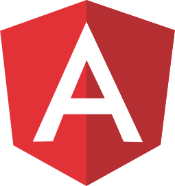
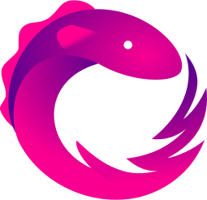
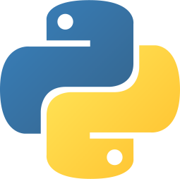
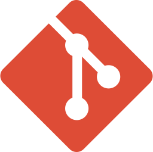
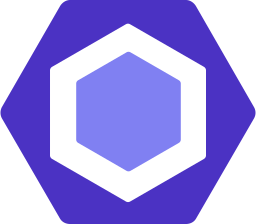

### Hi there 👋

I'm a Full Stack Developer from Morocco 🇲🇦, enthusiastic about solving problems & writing clean code :sparkles: , with a constantly growing love for new technologies. Besides programming, I enjoy watching animes & playing games :video_game:.

  
<b>I'm currently working with</b> 👇

  

  <a href="https://reactjs.org/" target="_blank" title="React">
  <a href="https://nodejs.org/en/" target="_blank" title="Node.js">
  <a href="https://www.mongodb.com/" target="_blank" title="MongoDB">
  <a href="https://angular.io/" target="_blank" title="Angular">
  
  <a href="https://www.typescriptlang.org/" target="_blank" title="Typescript">
  <a href="https://rxjs.dev/" target="_blank" title="RxJS">
  <a href="https://www.php.net/" target="_blank" title="PHP">
  <a href="https://www.python.org/" target="_blank" title="Python">
  
  
  
  
  
  
  
  

  
<b>Statistics</b> 📈

  

  
  <a href="https://github.com/AXeL-dev">
    <!--
    
    -->
    
  </a>
  
  
  
  

  
  

  

  
<b>Feel free to reach me at</b> 📫

  
  

  
  
  

